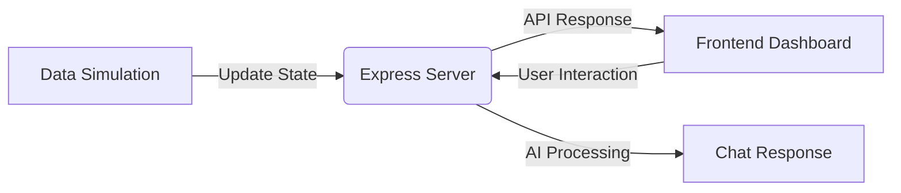

# 🏟️ CrowdFlow AI: Intelligent Stadium Management

[](https://crowdflow-ai-qmvzyqarda-uc.a.run.app)
[](https://nodejs.org)
[](https://expressjs.com)
[](https://www.docker.com)
[](LICENSE)

**CrowdFlow AI** is a professional-grade full-stack solution designed to revolutionize the way large-scale sporting venues manage crowd dynamics. By combining real-time data simulation with a context-aware AI assistant, it ensures safer, smoother, and more efficient event operations.

---

## 🎯 Chosen Vertical: Smart Stadiums & Event Management

This project focuses on the **Sports & Large-scale Events** vertical. Managing tens of thousands of people in real-time requires more than just static monitoring—it requires dynamic, actionable intelligence. CrowdFlow AI addresses the specific pain points of venue operators:
- **Safety**: Identifying and mitigating critical bottleneck zones.
- **Experience**: Reducing wait times at concessions and facilities.
- **Efficiency**: Optimizing visitor flow through intelligent routing.

---

## 🧠 Approach and Logic

The core logic of CrowdFlow AI is centered around **Dynamic Context Integration**. 

1. **Simulated State Management**: The backend maintains a live "world state" of the stadium, updating occupancy, wait times, and congestion levels every 2.8 seconds.
2. **Context-Aware Parsing**: The "Ask Me" agent uses a specialized natural language processor (NLP) logic that maps user intent directly to the current state of the stadium data. 
3. **Proactive Heuristics**: If a user asks about a facility with a high wait time, the system doesn't just report the time—it proactively searches for and suggests a better alternative.

---

## ⚙️ How the Solution Works

CrowdFlow AI is architected as a high-performance monolith for low-latency synchronization between data and visualization.

### 1. The Real-Time Pipeline


### 2. Frontend Layer
Built with Vanilla JS for maximum performance, the frontend polls the backend every 2.8 seconds. It performs direct DOM manipulation to update the SVG heatmap and statistical cards without full-page reloads, ensuring a "live" feel.

### 3. Backend Layer (Monolith)
The Node.js/Express backend serves as both the API provider and the static file host. This monolithic approach ensures that the UI and API are always in sync and simplifies the deployment to a single containerized service.

### 4. Cloud Infrastructure
Containerized via **Docker** and deployed to **Google Cloud Run**, the application scales automatically to handle event-day traffic spikes.

---

## 📋 Any Assumptions Made

During development, the following operational assumptions were made:
- **Simulated Cadence**: A 2.8-second update frequency is assumed to be an optimal balance between "real-time" responsiveness and network efficiency for stadium monitoring.
- **Keyword Entry Points**: It is assumed that users will use primary identifiers (e.g., "North Stand", "Food Court", "Gate E") when interacting with the AI agent.
- **Global State**: The simulation assumes a unified state for all dashboard users, simulating a central command center environment.

---

## 📦 Installation & Deployment

### Local Setup
```bash
git clone https://github.com/ShreyashChaugule-github/CrowdAI.git
cd CrowdAI/backend
npm install
npm run dev
```

### Cloud Run Deployment
```bash
gcloud run deploy crowdflow-ai --source . --project promptwars-493509
```

---

## 📄 License
This project is licensed under the MIT License.